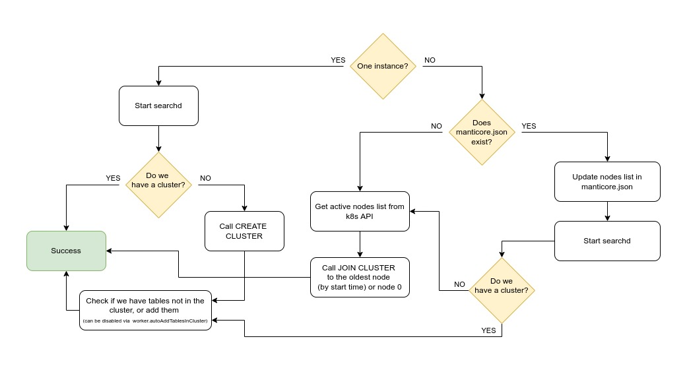
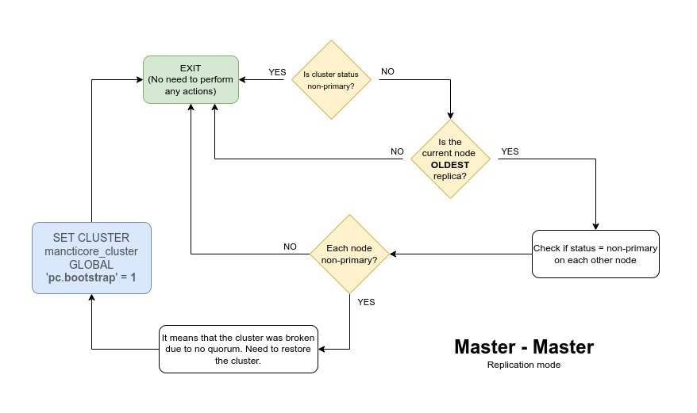
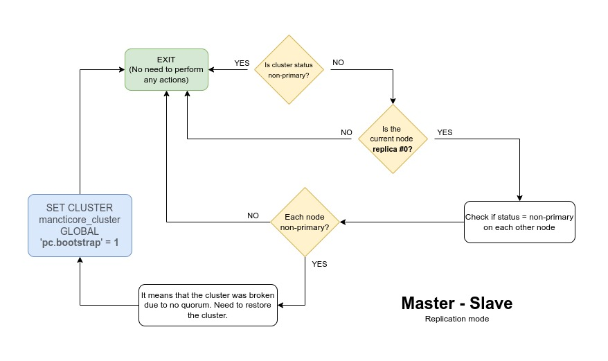

# Manticore Search Helm Chart

Version: 5.0.2.5

The helm chart is to be used to run Manticore Search in Kubernetes. It enables high availability by providing out-of-the-box replication and higher read throughput by automatic load balancing.

### What this helm chart does
* Deploys a StatefulSet with one or multiple Manticore Search pods (aka workers) that constitute a replication cluster.
* Deploys a StatefulSet with a single Manticore Search balancer instance.
* Deploys needed services.
* Provides Prometheus exporter for the running instances of Manticore Search.

### What you can do with the helm chart
* You can create a table on any worker pod, add it to the cluster and it will be replicated to all the other pods.
* You can scale the workers StatefulSet up and a new worker will be set up automatically to become a new replica in the cluster.
* You can scale the workers StatefulSet down and the cluster will forget about the node.
* If a worker is back up after a downtime it will rejoin the cluster and will be synced up to the active workers.
* When you make a search request to the balancer it will route it to one of the workers.
* [Data compaction](https://manual.manticoresearch.com/Securing_and_compacting_an_index/Compacting_an_index#Compacting-an-index) is done automatically.


# Installation

## Installation from Helm repo
```bash
helm repo add manticoresearch https://helm.manticoresearch.com
# update values.yaml if needed, see below
helm install manticore -n manticore --create-namespace manticoresearch/manticoresearch
```

## Installation from GitHub (dev version)
```bash
git clone https://github.com/manticoresoftware/manticoresearch-helm
cd manticoresearch-helm/charts/manticoresearch/
# update values.yaml if needed, see below
helm install manticore -n manticore --create-namespace .
```

If you want to install a release version use `git checkout` <release tag> or download an archive from https://github.com/manticoresoftware/manticoresearch-helm/releases .

# Quick start guide:

1) Export namespace name to variable for your convenience:
   
```bash
export NAMESPACE=manticore
```

### Wait until it starts
Wait until all pods are moved to running state:

```bash
kubectl --namespace $NAMESPACE get po
```

### Forward worker's port
Forward worker's port to your local machine:
```bash
export WORKER_NAME=$(kubectl get pods --namespace $NAMESPACE \
-l "app.kubernetes.io/name=manticoresearch,app.kubernetes.io/instance=manticore,app.kubernetes.io/component=worker" \
-o jsonpath="{.items[0].metadata.name}")
```

| SQL | HTTP | 
|---|---|
|`kubectl --namespace $NAMESPACE port-forward $WORKER_NAME 7306:9306` | `kubectl --namespace $NAMESPACE port-forward $WORKER_NAME 7308:9308` | 

### Connect to the worker

| SQL | HTTP | 
|---|---|
|`mysql -h0 -P7306`| No connection required since HTTP is a stateless protocol |

### Create your first table:

| SQL | HTTP | 
|---|---|
|`CREATE TABLE idx(title text);`|`curl -X "POST" localhost:7308/sql -d "mode=raw&query=create table idx(title text)"`|

### Add table to cluster:

| SQL | HTTP | 
|---|---|
|`ALTER CLUSTER manticore_cluster ADD idx;`|`curl -X "POST" localhost:7308/sql -d "mode=raw&query=alter cluster manticore_cluster add idx"`|

### Add some data to your table:

**SQL**
```sql
INSERT INTO manticore_cluster:idx (title) VALUES ('dog is brown'), ('mouse is small');
```

**HTTP**
```bash
curl -X "POST" -H "Content-Type: application/x-ndjson" localhost:7308/bulk -d '

{"insert": {"cluster":"manticore_cluster", "index" : "idx", "doc": { "title" : "dog is brown" } } }
{"insert": {"cluster":"manticore_cluster", "index" : "idx", "doc": { "title" : "mouse is small" } } }'
```

### Forward load balancer's port to your local machine:

```bash
export NAMESPACE=manticore
export BALANCER_NAME=$(kubectl get pods --namespace $NAMESPACE \
-l "app.kubernetes.io/name=manticoresearch,app.kubernetes.io/instance=manticore,name=manticore-manticoresearch-balancer" \
-o jsonpath="{.items[0].metadata.name}")
```

| SQL | HTTP | 
|---|---|
|`kubectl --namespace $NAMESPACE port-forward $BALANCER_NAME 6306:9306`|`kubectl --namespace $NAMESPACE port-forward $BALANCER_NAME 6308:9308`|

### Search through the balancer:

| SQL | HTTP | 
|---|---|
|`mysql -h0 -P6306 -e "SELECT * FROM idx WHERE match('dog')"`|`curl -X "POST" localhost:6308/search -d '{"index" : "idx", "query": { "match": { "_all": "dog" } } }'`|

### Scale the cluster:

```
kubectl scale statefulsets manticore-manticoresearch-worker -n manticore --replicas=5
```

## Q&A:
#### Where is the data actually stored?
In volumes. One volume per worker. The PVC is by default 1 gigabyte (see variable `worker.volume.size`)

#### How is high availability achieved?
* synchronous master-master replication
* data remains in volume even after the worker is stopped/deleted

#### If a worker pod goes down, is its data lost?
The volume associated with the work doesn't get deleted.

#### What happens when a worker pod goes back up?
It reuses the data existing before it went down. Then it tries to join the cluster and if the data is fresh enough it will catch up by applying recent changes occurred in the cluster, otherwise it will do full sync like if it was a completely new worker. If it can't find the cluster at all it will try to join the oldest node or node 0 (see below about replication modes).

#### How do I delete data?
Clean up the volumes manually or delete the whole namespace.

#### What happens when a new worker pod comes up?
* The Manticore Search worker pod starts running searchd as the main process
* A side process running in the pod checks for active siblings
* If it finds some, it joins to the oldest one

#### What happens if I uninstall the helm chart?
The volumes will still retain the data and if you install the chart again to the same namespace you'll be able to access it.

### How does the balancer work?
Each 5 seconds (see `balancer.runInterval`) the balancer:
* Checks tables on the 1st active worker.
* If it differs from its current state it catches up by reloading itself with a new tables configuration.

When a worker stops it also sends a singal to the balancer, so it doesn't have to wait 5 seconds.

### How does auto OPTIMIZE work?
To enable automatic index compaction you need to update `values.yaml` and set `optimize.enabled = true`. `optimize.interval` controls how often to attempt disk chunks merging.

Automatic index compaction follows this algorithm:
1) Only one compaction session (OPTIMIZE) at once is allowed, so we check if previous OPTIMIZE finished or never started.
2) If all is ok we get info about pods labeled as `component=worker + instance` and attempt OPTIMIZE on each one by one.
3) We pick the index which makes sense to compact next.
4) We get number of CPU cores to calculate the optimial chunks count to leave after the compaction:
  a) either from the pod's limits
  b) of it's not set - from the host
5) And run OPTIMIZE with `cutoff=<cpuCores * values.optimize.coefficient>`

### How does replication work?
The replication script affects only worker pods. Each worker does the following every time it starts:


### What's the difference between the replication modes?

Manticore Search Helm chart can work in one of the two replication modes: master-to-master and master-to-slave. The modes control behaviour of a worker pod which is being added to a cluster or an existing worker which restarts and for some reason can't connect to the cluster.

#### Master to master replication mode
In this mode a worker pod connects to the oldest node. Write queries are to be made via service and are load balanced among all the workers, i.e. **writes are highly-available**. In case of a crash the oldest worker will become a base worker for others. This mode is recommended in most cases, but in case of a full shutdown and `quorumRecovery` enabled it may cause data loss if there were writes to the cluster while the workers were being stopped. Imagine, worker 0 stops, but we keep writing to worker 1, then it stops as well, then worer 2 stops too, then all of them come back up starting from worker 0 and if we then connect to the oldest worker (0) on workers 1 and 2 we'll lose the writes landed on worker 1.

#### Master to slave replication mode
In this mode all writes are to be made to worker 0. All other workers connect to it on start if they lose the cluster info. In case worker 0 is down no writes are accepted any more, i.e. **there's no highly available writes**, but since we know that worker 0 is the most advanced we can be sure that we won't lose any data during failover. 

### What is `quorumRecovery`?
If a cluster loses more than a half of nodes it means it's lost the quorum and writes are blocked until it's recovered. If you set `quorumRecovery: true` Manticore will try to recover the quorum automatically by reinitializing the cluster from the oldest worker or worker 0 depending on the replication mode:

#### Master to master quorum recovery


#### Master to slave quorum recovery


## Making queries to the cluster
### Writes
Write queries (INSERT/UPDATE/DELETE/REPLACE/TRUNCATE/ALTER) are supposed to be made to the worker pods (either of them). From inside k8s you can connect to:
##### How to connect:
* via mysql - `manticore-manticoresearch-worker-svc.manticore.svc.cluster.local:9306`
* via http - `manticore-manticoresearch-worker-svc.manticore.svc.cluster.local:9308`

### Reads
Read queries are supposed to be made to the balancer pod. It won't fail if you run a SELECT on a worker pod, but it won't be routed to the most appropriate worker in this case.

##### How to connect:
* via mysql - `manticore-manticoresearch-balancer-svc.manticore.svc.cluster.local:9306`
* via http - `manticore-manticoresearch-balancer-svc.manticore.svc.cluster.local:9308`

where:
* `manticore-` - the chart name you specified in `helm install`
* `manticoresearch-worker-svc.` - worker's service name
* `manticore.` - namespace where the helm chart is installed
* `svc.cluster.local` - means you are connecting to a service

Read more details in [k8s documentation](https://kubernetes.io/docs/concepts/services-networking/dns-pod-service/).


# Variables

| Variable | Description | Default |
|---|---|---|
| balancer.runInterval | How often to check for schema changes on workers, seconds | 5 |
| balancer.config.content | Balancer config (only section `searchd`) | searchd<br>      {<br>       listen = /var/run/mysqld/mysqld.sock:mysql<br>        listen = 9306:mysql<br>        listen = 9308:http<br>        log = /dev/stdout<br>        query_log = /dev/stdout<br>        query_log_format = sphinxql<br>        pid_file = /var/run/manticore/searchd.pid<br>        binlog_path = /var/lib/manticore/data<br>      } |
| worker.replicaCount | Default workers count (number of replicas) | 3 |
| worker.clusterName | Name of replication cluster | manticore |
| worker.persistence.size | Worker max storage size (mounted volume) | 1Gi |
| worker.persistence.storageClass | Worker storage class | - |
| worker.config.content | Worker config (only section `searchd`). <br>**Important**: you must always pass `$ip` to the config for proper functioning | searchd<br>      {<br>        listen = /var/run/mysqld/mysqld.sock:mysql<br>        listen = 9306:mysql<br>        listen = 9308:http<br>        listen = 9301:mysql_vip<br>        listen = $ip:9312<br>        listen = $ip:9315-9415:replication<br>        binlog_path = /var/lib/manticore/data<br>        log = /dev/stdout<br>        query_log = /dev/stdout<br>        query_log_format = sphinxql<br>        pid_file = /var/run/manticore/searchd.pid<br>        data_dir = /var/lib/manticore<br>        shutdown_timeout = 25s<br>        auto_optimize = 0<br>      } |
| exporter.enabled | Enable Prometheus exporter pod | false |

#### More Variables

<details>

| Variable | Description | Default |
|---|---|---|
| balancer.image.repository | Balancer docker image repository | Docker hub
| balancer.image.tag | Balancer image version | Same as chart version |
| balancer.image.pullPolicy | Balancer docker image update policy | IfNotPresent |
| balancer.service.ql.port | Balancer service SQL port (for searchd) | 9306 |
| balancer.service.ql.targetPort | Balancer service SQL targetPort (for searchd) | 9306 |
| balancer.service.http.port | Balancer service HTTP port (for searchd) | 9306 |
| balancer.service.http.targetPort | Balancer service HTTP targetPort (for searchd) | 9306 |
| balancer.service.observer.port | Balancer service port (for observer) | 8080 |
| balancer.service.observer.targetPort | Balancer service targetPort (for observer) | 8080 |
| balancer.config.path | Path to balancer config | /etc/manticoresearch/configmap.conf
| worker.image.repository | Worker docker image repository | Docker hub |
| worker.image.tag | Worker image version | Same as chart version |
| worker.image.pullPolicy | Worker docker image update policy | IfNotPresent |
| worker.quorumRecovery | Worker quorum auto recovery | false |
| worker.quorumCheckInterval | Check quorum ever so often (seconds) | 15 |
| worker.service.ql.port | Worker service SQL port | 9306 |
| worker.service.ql.targetPort | Worker service SQL targetPort | 9306 |
| worker.service.http.port | Worker service HTTP port | 9306 |
| worker.service.http.targetPort | Worker service HTTP targetPort | 9306 |
| worker.config.path | Path to worker config | /etc/manticoresearch/configmap.conf |
| nameOverride | Allows to override chart name | "" |
| fullNameOverride | Allows to override full chart name | "" |
| serviceAccount.annotations | Allows to add service account annotations | "" |
| serviceAccount.name | Service account name | "manticore-sa" |
| podAnnotations | Allows to set pods annotations for worker and balancer | {} |
| podSecurityContext | Allows to set pod security contexts | {} |
| securityContext | Allows to set security contexts (see k8s docs for details) | {} |
| resources | Allows to set resources like mem or cpu requests and limits (see k8s docs for details) | {} |
| nodeSelector | Allows to set node selector for worker and balancer | {} |
| tolerations | Allows to set tolerations (see k8s docs for details) | {} |
| affinity | Allows to set affinity (see k8s docs for details) | {} |
| exporter.image.repository | Prometheus exporter docker image repository | Docker hub |
| exporter.image.tag | Prometheus exporter image version | Same as chart version |
| exporter.image.pullPolicy | Prometheus exporter image update policy (see k8s docs for details) | IfNotPresent |
| exporter.image.annotations | Prometheus exporter annotations (Need for correct resolving) |     prometheus.io/path: /metrics<br>    prometheus.io/port: "8081"<br>    prometheus.io/scrape: "true" |
| optimize.enabled | Switch on auto optimize script  |     false |
| optimize.interval | Interval in seconds for running optimize script  |     false |

</details>

# Uninstall

* `helm uninstall manticore -n manticore`
* Delete PVCs manually or the whole namespace.
