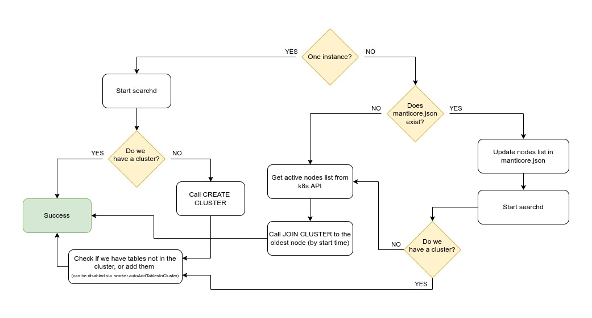

# Manticore Search Helm Chart

**Version:** 7.0.0.0

The Manticore Search Helm Chart is designed to deploy and manage Manticore Search in Kubernetes. It ensures high availability with out-of-the-box replication and improves read throughput through automatic load balancing.

---


## Features

### What This Helm Chart Does
- Deploys a StatefulSet with one or multiple Manticore Search pods (workers) to form a replication cluster.
- Rolls out a Deployment with one or multiple Manticore Search load balancer instances (configurable in `values.yaml`).
- Deploys essential Kubernetes services.
- Provides a Prometheus exporter for monitoring running Manticore Search instances.

### Capabilities
- **Cluster Replication:** Create a table on any worker pod, add it to the cluster, and it replicates to all other pods.
- **Scaling:** Scale the workers' StatefulSet up or down, automatically adding or removing replicas in the cluster.
- **Resilience:** Workers that recover from downtime automatically sync with the active workers in the cluster.
- **Load Balancing:** Search requests made to the balancer are routed to one of the workers.
- **Automatic Data Compaction:** [Index compaction](https://manual.manticoresearch.com/Securing_and_compacting_an_index/Compacting_an_index#Compacting-an-index) is handled automatically.
- **Direct Read/Write Access:** Can perform reading and writing operations directly on any worker pod using Kubernetes' built-in load balancing capabilities, bypassing the need for the balancer provided by the helm chart.
---

## Installation

### Installation from Helm Repository
```bash
helm repo add manticoresearch https://helm.manticoresearch.com
# Update values.yaml if needed
helm install manticore -n manticore --create-namespace manticoresearch/manticoresearch
```

### Installation from GitHub (Development Version)
```bash
git clone https://github.com/manticoresoftware/manticoresearch-helm
cd manticoresearch-helm/charts/manticoresearch/
# Update values.yaml if needed
helm install manticore -n manticore --create-namespace .
```
For a specific release version, use:
```bash
git checkout <release-tag>
```
or download an archive from [GitHub releases](https://github.com/manticoresoftware/manticoresearch-helm/releases).

---

## Quick Start Guide

1. **Export Namespace and Chart Name for Convenience**
   ```bash
   export NAMESPACE=manticore
   export CHART_NAME=helm
   ```

2. **Wait for All Pods to Start**
   ```bash
   kubectl --namespace $NAMESPACE get po
   ```

3. **Forward Ports**

   If you need to expose an HTTP port, you should use **9308** instead of **9306**.

   Ports for SQL/HTTP protocols are configurable via searchd settings. see [Searchd Configuration.](https://manual.manticoresearch.com/dev/Server_settings/Searchd#listen)

    - **Worker Ports:**
      ```bash
      kubectl --namespace $NAMESPACE port-forward service/${CHART_NAME}-manticoresearch-worker-svc 7306:9306
      ```
    - **Load Balancer Ports:**
      ```bash
      kubectl --namespace $NAMESPACE port-forward service/${CHART_NAME}-manticoresearch-balancer-svc 6306:9306
      ```
      

4. **Connect to the Worker**
    - **SQL:**
      ```bash
      mysql -h0 -P7306
      ```
    - **HTTP:** If you plan to use HTTP, you can skip this step.

5. **Create Your First Table**
    - **SQL:**
      ```sql
      CREATE TABLE idx(title text);
      ```
    - **HTTP:**
      ```bash
      curl 0:7038/cli -d "create table idx(title text)"
      ```

6. **Add the Table to the Cluster**
    - **SQL:**
      ```sql
      ALTER CLUSTER manticore_cluster ADD idx;
      ```
    - **HTTP:**
      ```bash
      curl 0:7038/cli -d "alter cluster manticore_cluster add idx"
      ```

7. **Insert Data into the Table**
    - **SQL:**
      ```sql
      INSERT INTO manticore_cluster:idx (title) VALUES ('dog is brown'), ('mouse is small');
      ```
    - **HTTP:**
      ```bash
      curl -H "Content-Type: application/x-ndjson" localhost:7308/bulk -d '
      {"insert": {"cluster":"manticore_cluster", "table" : "idx", "doc": { "title" : "dog is brown" } } }
      {"insert": {"cluster":"manticore_cluster", "table" : "idx", "doc": { "title" : "mouse is small" } } }'
      ```

8. **Search Through the Balancer**
    - **SQL:**
      ```bash
      mysql -h0 -P6306 -e "SELECT * FROM idx WHERE match('dog')"
      ```
    - **HTTP:**
      ```bash
      curl -X "POST" localhost:6308/search -d '{"table" : "idx", "query": { "match": { "_all": "dog" } } }'
      ```

9. **Scale the Cluster**
   ```bash
   kubectl scale statefulsets manticore-manticoresearch-worker -n manticore --replicas=5
   ```

---

## Q&A

### Where is the Data Stored?
Data is stored in PersistentVolumeClaims (PVCs). Each worker pod has its own volume. By default, the PVC size is 1Gi (configurable via `worker.volume.size`).

### How is High Availability Achieved?
- **Replication:** Synchronous master-master replication ensures data durability.
- **Data Persistence:** Worker volumes retain data even if pods are deleted.
- **Advanced Recovery Logic:** High availability is further supported by advanced recovery mechanisms, enabling data restoration through [Backup and Restore](https://manual.manticoresearch.com/dev/Securing_and_compacting_a_table/Backup_and_restore#Backup-and-Restore ).

### What happens when a worker pod goes back up?
It reuses the data existing before it went down. Then it tries to join the cluster and if the data is fresh enough it will catch up by applying recent changes occurred in the cluster, otherwise it will do full sync like if it was a completely new worker. If it can't find the cluster at all it will try to join the oldest node or node 0 (see below about replication modes).

### How Do I Delete Data?
You can truncate or delete tables, manually clean volumes, or delete the entire namespace.

### What Happens When a New Worker Pod is Added?
- The new pod starts and runs a side process to check for active nodes.
- It joins the oldest node or the cluster's primary worker.
- The pod waits until it fully syncs before becoming operational.

### What happens if I uninstall the helm chart?
The volumes will still retain the data and if you install the chart again to the same namespace you'll be able to access it.

### What Is the Balancer and How Does It Work?

The balancer in Manticore Search is an optional component for managing high availability (HA) in a replication cluster. It distributes read operations efficiently across available worker pods, while write operations bypass the balancer and are sent directly to the worker pods.

**Pros:**
* Enhances HA by efficiently balancing read requests.

**Cons:**
* Increases usage complexity, as it requires different entry points for read and write operations.

#### Key Functions of the Balancer:
- **Read Operations:** The balancer intelligently routes read queries (`SELECT`) to the most appropriate workers based on their status and availability. This ensures load is distributed evenly across active workers, enhancing cluster efficiency and reliability.
- **Write Operations:** Writes (`INSERT`, `UPDATE`, etc.) should be manually sent directly to the worker pods, bypassing the balancer.

#### How the Balancer Works:
1. **Dynamic Synchronization:**
   - If `balancer.enabled` is set to `true` (default), the balancer checks the table configuration on the first active worker every 5 seconds (configurable via the `balancer.runInterval` parameter).
   - If the configuration changes, the balancer reloads to align with the updated list of tables and available workers.

2. **Event-Driven Updates:**
   - When a worker starts or stops, it sends a signal to the balancer, prompting immediate synchronization without waiting for the interval.

3. **High Availability Strategy:**
   - The balancer achieves HA by using `table_ha_strategy: nodeads`, ensuring queries are routed only to healthy nodes.

4. **Replica Redundancy:**
   - To further improve HA for read operations, you can increase the number of balancer replicas by adjusting the `balancer.replicaCount` parameter in `values.yaml`.

#### Configuration Options:
- **Custom Behavior:** You can customize the balancer’s behavior using its HA strategy (`table_ha_strategy`).
- **Enhanced Performance:** Scaling the number of balancer replicas improves the cluster’s ability to handle read requests.


  For more details, refer to the [Load Balancing documentation](https://manual.manticoresearch.com/dev/Creating_a_cluster/Remote_nodes/Load_balancing#Load-balancing).

### How does Automatic Table Compaction work?

The Helm chart for Manticore Search provides two types of automatic table compaction:  
1. **Built-in auto compaction**: Enabled by default in Manticore Search itself.  
2. **Helm chart-provided auto compaction**: Can be enabled and configured separately as described below.

To enable the Helm chart-provided auto compaction, update `values.yaml` and set `optimize.enabled = true`. The frequency of disk chunk merging attempts is controlled by the `optimize.interval` parameter.

The Helm chart-provided auto compaction works as follows:
1. Ensures that only one compaction session runs at a time by checking whether the previous session has completed or has not started.
2. If all conditions are met, retrieves information about pods labeled with `component=worker + instance` and performs compaction on each pod sequentially.
3. Selects the table that will benefit the most from compaction.
4. Calculates the optimal chunk count to retain after compaction based on available CPU cores:
   - Uses the pod’s CPU limits if specified.
   - Defaults to the host’s total CPU cores if limits are not set.
5. Executes compaction with `cutoff=<cpuCores * values.optimize.coefficient>`.

By distinguishing between the default Manticore Search auto compaction and the one provided by the Helm chart, you can choose and configure the option that best fits your needs.

### How does replication work?
The replication script affects only worker pods. Each worker does the following every time it starts:


### What's the Difference Between the Replication Modes?

The Manticore Search Helm chart supports two replication modes: **master-to-master** and **master-to-slave**. These modes determine how a worker pod behaves when it joins a cluster or reconnects after being disconnected.

#### Master-to-Master Replication Mode

In this mode, a worker pod connects to the oldest node in the cluster. Write queries are routed through the service and load-balanced across all workers, providing **high availability for writes**.

- **Advantages:** This mode is recommended for most use cases as it ensures that writes are distributed among all active nodes.
- **Potential Risk:** In scenarios involving a complete cluster shutdown and with `quorumRecovery` enabled, data loss can occur if writes are made to different workers during downtime. For example, if worker 0 stops but writes continue to worker 1, and then worker 1 stops while writes are directed to worker 2, restarting the cluster from worker 0 may result in the loss of the writes made to workers 1 and 2.

#### Master-to-Slave Replication Mode

In this mode, all writes are directed to worker 0. Other workers connect to worker 0 if they lose cluster information.

- **Advantages:** This mode guarantees data consistency since worker 0 always holds the most up-to-date data.
- **Limitations:** **Writes are not highly available.** If worker 0 goes down, no writes can be processed until it is restored

Note: This mode is not available if the Manticore Load Balancer is disabled.

### What Is `quorumRecovery`?

`quorumRecovery` addresses scenarios where a cluster loses a majority of its nodes, leading to a loss of quorum and blocking writes.

- When `quorumRecovery: true` is set, Manticore automatically attempts to recover the quorum by reinitializing the cluster from the oldest worker or worker 0, depending on the replication mode.

#### Master to master quorum recovery


#### Master to slave quorum recovery


## Making Queries to the Cluster

By default, read and write operations are separated to achieve additive high availability (HA) using the built-in Manticore Search [Load Balancing](https://manual.manticoresearch.com/dev/Creating_a_cluster/Remote_nodes/Load_balancing#Load-balancing).

If this behavior is unnecessary or having separate entry points for reads and writes is inconvenient, you can disable it by setting `balancer.enabled` to `false` in `values.yaml`. In this case, a single entry point will handle all requests:
- MySQL protocol: `{your-chart-name}-manticoresearch-worker-svc.manticore.svc.cluster.local:9306`
- HTTP: `{your-chart-name}-manticoresearch-worker-svc.manticore.svc.cluster.local:9308`

Below is an explanation of how to interact with the cluster when **Manticore Search Load Balancer** is enabled:

### Writes

Write queries (`INSERT`, `UPDATE`, `DELETE`, `REPLACE`, `TRUNCATE`, `ALTER`) should be sent directly to the worker pods. These queries can be made to any worker pod.

#### How to Connect:
- **MySQL:** `{your-chart-name}-manticoresearch-worker-svc.manticore.svc.cluster.local:9306`
- **HTTP:** `{your-chart-name}-manticoresearch-worker-svc.manticore.svc.cluster.local:9308`

### Reads

Read queries should be routed through the balancer deployment for optimal distribution across worker pods. While running a `SELECT` query directly on a worker pod is possible, it will not leverage load balancing or routing to the most appropriate worker.

#### How to Connect:
- **MySQL:** `{your-chart-name}-manticoresearch-balancer-svc.manticore.svc.cluster.local:9306`
- **HTTP:** `{your-chart-name}-manticoresearch-balancer-svc.manticore.svc.cluster.local:9308`

### Explanation of Connection Parameters:

- **`{your-chart-name}`**: The chart name specified during `helm install`.
- **`manticoresearch-worker-svc.`**: The worker service name.
- **`manticore.`**: The namespace where the Helm chart is installed.
- **`svc.cluster.local`**: The default domain for Kubernetes services.

For more details, refer to the [Kubernetes documentation](https://kubernetes.io/docs/concepts/services-networking/dns-pod-service/).
---

## Variables

| Variable | Description                                                                                                                | Default                                                                                                                                                                                                                                                                                                                                                                                                                                                                                                                                                                             |
|---|----------------------------------------------------------------------------------------------------------------------------|-------------------------------------------------------------------------------------------------------------------------------------------------------------------------------------------------------------------------------------------------------------------------------------------------------------------------------------------------------------------------------------------------------------------------------------------------------------------------------------------------------------------------------------------------------------------------------------|
| balancer.enabled | Enable/disable the load balancer | true |
| balancer.replicaCount | Default balancers count (number of replicas)                                                                               | 1                                                                                                                                                                                                                                                                                                                                                                                                                                                                                                                                                                                   |
| balancer.runInterval | How often to check for schema changes on workers, seconds                                                                  | 5                                                                                                                                                                                                                                                                                                                                                                                                                                                                                                                                                                                   |
| balancer.config.content | Balancer config (only section `searchd`)                                                                                   | searchd<br>      {<br>       listen = /var/run/mysqld/mysqld.sock:mysql<br>        listen = 9306:mysql<br>        listen = 9308:http<br>        log = /dev/stdout<br>        query_log = /dev/stdout<br>        query_log_format = sphinxql<br>        pid_file = /var/run/manticore/searchd.pid<br>        binlog_path = /var/lib/manticore/data<br>      }                                                                                                                                                                                                                        |
| worker.replicaCount | Default workers count (number of replicas)                                                                                 | 3                                                                                                                                                                                                                                                                                                                                                                                                                                                                                                                                                                                   |
| worker.replicationMode | Workers replication mode                                                                                                   | master-slave                                                                                                                                                                                                                                                                                                                                                                                                                                                                                                                                                                          |
| worker.clusterName | Name of replication cluster                                                                                                | manticore                                                                                                                                                                                                                                                                                                                                                                                                                                                                                                                                                                           |
| worker.persistence.size | Worker max storage size (mounted volume)                                                                                   | 1Gi                                                                                                                                                                                                                                                                                                                                                                                                                                                                                                                                                                                 |
| worker.persistence.storageClass | Worker storage class                                                                                                       | -                                                                                                                                                                                                                                                                                                                                                                                                                                                                                                                                                                                   |
| worker.config.content | Worker config (only section `searchd`). <br>**Important**: you must always pass `$hostname` to the config for proper functioning | searchd<br>      {<br>        listen = /var/run/mysqld/mysqld.sock:mysql<br>        listen = 9306:mysql<br>        listen = 9308:http<br>        listen = 9301:mysql_vip<br>        listen = $hostname:9312<br>        listen = $hostname:9315-9415:replication<br>        node_address = $hostname<br>        binlog_path = /var/lib/manticore<br>        log = /dev/stdout<br>        query_log = /dev/stdout<br>        query_log_format = sphinxql<br>        pid_file = /var/run/manticore/searchd.pid<br>        data_dir = /var/lib/manticore<br>        shutdown_timeout = 25s<br>        auto_optimize = 0<br>      } |
| exporter.enabled | Enable Prometheus exporter pod                                                                                             | false                                                                                                                                                                                                                                                                                                                                                                                                                                                                                                                                                                               |

### Additional Variables
<details>
<summary>Click to expand</summary>

| Variable                             | Description                                                                                         | Default                                                                                            |
|--------------------------------------|-----------------------------------------------------------------------------------------------------|----------------------------------------------------------------------------------------------------|
| balancer.extraPackages               | Should it install the extra packages like Manticore Columnar Library for support of the columnar storage and secondary indexes, Manticore Buddy for support for specific commands etc         | true                                                                                               |
| balancer.image.repository            | Balancer docker image repository                                                                    | Docker hub                                                                                         |
| balancer.image.tag                   | Balancer image version                                                                              | Same as chart version                                                                              |
| balancer.image.pullPolicy            | Balancer docker image update policy                                                                 | IfNotPresent                                                                                       |
| balancer.service.ql.port             | Balancer service SQL port (for searchd)                                                             | 9306                                                                                               |
| balancer.service.ql.targetPort       | Balancer service SQL targetPort (for searchd)                                                       | 9306                                                                                               |
| balancer.service.http.port           | Balancer service HTTP port (for searchd)                                                            | 9306                                                                                               |
| balancer.service.http.targetPort     | Balancer service HTTP targetPort (for searchd)                                                      | 9306                                                                                               |
| balancer.service.observer.port       | Balancer service port (for observer)                                                                | 8080                                                                                               |
| balancer.service.observer.targetPort | Balancer service targetPort (for observer)                                                          | 8080                                                                                               |
| balancer.service.binary.port         | Balancer service binary port (for searchd)                                                          | 9312                                                                                               |
| balancer.service.binary.targetPort   | Balancer service binary targetPort (for searchd)                                                    | 9312                                                                                               |
| balancer.config.path                 | Path to balancer config                                                                             | /mnt/configmap.conf                                                                                |
| balancer.config.table_ha_strategy    | Distributed indexes HA strategy                                                                     | nodeads                                                                                            |
| balancer.resources                   | Allows to set resources for balancer like mem or cpu requests and limits (see k8s docs for details) | {}                                                                                                 |
| worker.image.repository              | Worker docker image repository                                                                      | Docker hub                                                                                         |
| worker.image.tag                     | Worker image version                                                                                | Same as chart version                                                                              |
| worker.image.pullPolicy              | Worker docker image update policy                                                                   | IfNotPresent                                                                                       |
| worker.quorumRecovery                | Worker quorum auto recovery                                                                         | false                                                                                              |
| worker.quorumCheckInterval           | Check quorum ever so often (seconds)                                                                | 15                                                                                                 |
| worker.autoAddTablesInCluster        | Automatically adds all tables into cluster                                                          | 15                                                                                                 |
| worker.service.ql.port               | Worker service SQL port                                                                             | 9306                                                                                               |
| worker.service.ql.targetPort         | Worker service SQL targetPort                                                                       | 9306                                                                                               |
| worker.service.http.port             | Worker service HTTP port                                                                            | 9306                                                                                               |
| worker.service.http.targetPort       | Worker service HTTP targetPort                                                                      | 9306                                                                                               |
| worker.config.path                   | Path to worker config                                                                               | /mnt/configmap.conf                                                                                |
| worker.resources                     | Allows to set resources for worker like mem or cpu requests and limits (see k8s docs for details)   | {}                                                                                                 |
| nameOverride                         | Allows to override chart name                                                                       | ""                                                                                                 |
| fullNameOverride                     | Allows to override full chart name                                                                  | ""                                                                                                 |
| serviceAccount.annotations           | Allows to add service account annotations                                                           | ""                                                                                                 |
| serviceAccount.name                  | Service account name                                                                                | "manticore-sa"                                                                                     |
| podAnnotations                       | Allows to set pods annotations for worker and balancer                                              | {}                                                                                                 |
| podSecurityContext                   | Allows to set pod security contexts                                                                 | {}                                                                                                 |
| securityContext                      | Allows to set security contexts (see k8s docs for details)                                          | {}                                                                                                 |
| nodeSelector                         | Allows to set node selector for worker and balancer                                                 | {}                                                                                                 |
| tolerations                          | Allows to set tolerations (see k8s docs for details)                                                | {}                                                                                                 |
| affinity                             | Allows to set affinity (see k8s docs for details)                                                   | {}                                                                                                 |
| exporter.image.repository            | Prometheus exporter docker image repository                                                         | Docker hub                                                                                         |
| exporter.image.tag                   | Prometheus exporter image version                                                                   | Same as chart version                                                                              |
| exporter.image.pullPolicy            | Prometheus exporter image update policy (see k8s docs for details)                                  | IfNotPresent                                                                                       |
| exporter.image.annotations           | Prometheus exporter annotations (Need for correct resolving)                                        | prometheus.io/path: /metrics<br>    prometheus.io/port: "8081"<br>    prometheus.io/scrape: "true" |
| exporter.resources                   | Allows to set resources for exporter like mem or cpu requests and limits (see k8s docs for details) | {}                                                                                                 |
| optimize.enabled                     | Switch on auto optimize script                                                                      | true                                                                                               |
| optimize.interval                    | Interval in seconds for running optimize script                                                     | 30                                                                                                 |
| serviceMonitor.enabled               | Enables service monitor resource for exporting runtime metrics to Prometheus                        | false                                                                                              |
| serviceMonitor.interval              | Set how frequently Prometheus should scrape                        | 30s                                                                                                |
| serviceMonitor.scrapeTimeout         | Set timeout for scrape                        | 10s                                                                                                |

</details>

---

## Uninstallation
To uninstall the Helm chart:
```bash
helm uninstall manticore -n manticore
```
Delete PVCs manually or delete the entire namespace to remove persistent data.

